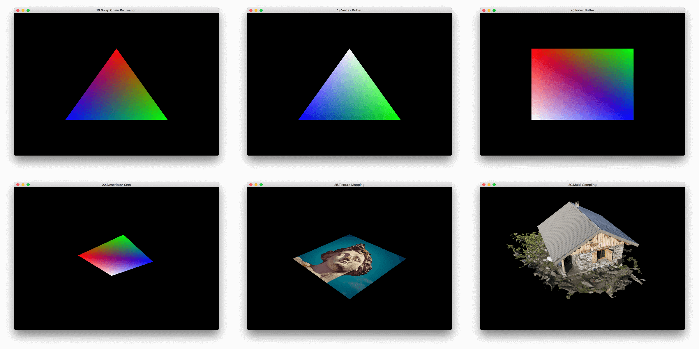

# vulkan-tutorial-rust

[](https://dev.azure.com/usami-ssc/usami-ssc/_build/latest?definitionId=5&branchName=master) [](LICENSE)

A Rust implementation of the [Vulkan Tutorial](https://vulkan-tutorial.com) based on [ash crate](https://crates.io/crates/ash).

## Status

The environment configuration is same as ash. See [here](https://github.com/MaikKlein/ash#example) for more detail.

Vulkan is quite hard. All examples on official website have been finished. :beers:

## Usage

Enter the project root directory, download the assets by the python3 script:

```shell
vulkan-tutorial-rust$ python download_asset.py
```

Run any example with the following command:

```shell
$ cargo run --bin example_number
```

Here replace `example_number` with option in the following table:

| example_number | Code                                                         | Reference                                                    | Note                                                         |
| -------------- | ------------------------------------------------------------ | ------------------------------------------------------------ | ------------------------------------------------------------ |
| 00             | [00_base_code.rs](./src/tutorials/00_base_code.rs)           | [Link](https://vulkan-tutorial.com/Drawing_a_triangle/Setup/Base_code) |                                                              |
| 01             | [01_instance_creation.rs](./src/tutorials/01_instance_creation.rs) | [Link](https://vulkan-tutorial.com/Drawing_a_triangle/Setup/Instance) |                                                              |
| 02             | [02_validation_layers.rs](./src/tutorials/02_validation_layers.rs) | [Link](https://vulkan-tutorial.com/Drawing_a_triangle/Setup/Validation_layers) |                                                              |
| 03             | [03_physical_device_selection.rs](./src/tutorials/03_physical_device_selection.rs) | [Link](https://vulkan-tutorial.com/Drawing_a_triangle/Setup/Physical_devices_and_queue_families) |                                                              |
| 04             | [04_logical_device.rs](./src/tutorials/04_logical_device.rs) | [Link](https://vulkan-tutorial.com/Drawing_a_triangle/Setup/Logical_device_and_queues) |                                                              |
| 05             | [05_window_surface.rs](./src/tutorials/05_window_surface.rs) | [Link](https://vulkan-tutorial.com/Drawing_a_triangle/Presentation/Window_surface) |                                                              |
| 06             | [06_swap_chain_creation.rs](./src/tutorials/06_swap_chain_creation.rs) | [Link](https://vulkan-tutorial.com/Drawing_a_triangle/Presentation/Swap_chain) |                                                              |
| 07             | [07_image_view.rs](./src/tutorials/07_image_view.rs)         | [Link](https://vulkan-tutorial.com/Drawing_a_triangle/Presentation/Image_views) |                                                              |
| 08             | [08_graphics_pipeline.rs](./src/tutorials/08_graphics_pipeline.rs) | [Link](https://vulkan-tutorial.com/Drawing_a_triangle/Graphics_pipeline_basics) |                                                              |
| 09             | [09_shader_modules.rs](./src/tutorials/09_shader_modules.rs) | [Link](https://vulkan-tutorial.com/Drawing_a_triangle/Graphics_pipeline_basics/Shader_modules) |                                                              |
| 10             | [10_fixed_functions.rs](./src/tutorials/10_fixed_functions.rs) | [Link](https://vulkan-tutorial.com/Drawing_a_triangle/Graphics_pipeline_basics/Fixed_functions) |                                                              |
| 11             | [11_render_passes.rs](./src/tutorials/11_render_passes.rs)   | [Link](https://vulkan-tutorial.com/Drawing_a_triangle/Graphics_pipeline_basics/Render_passes) |                                                              |
| 12             | [12_graphics_pipeline_complete.rs](./src/tutorials/12_graphics_pipeline_complete.rs) | [Link](https://vulkan-tutorial.com/Drawing_a_triangle/Graphics_pipeline_basics/Conclusion) |                                                              |
| 13             | [13_framebuffers.rs](./src/tutorials/13_framebuffers.rs)     | [Link](https://vulkan-tutorial.com/Drawing_a_triangle/Drawing/Framebuffers) |                                                              |
| 14             | [14_command_buffers.rs](./src/tutorials/14_command_buffers.rs) | [Link](https://vulkan-tutorial.com/Drawing_a_triangle/Drawing/Command_buffers) |                                                              |
| 15             | [15_hello_triangle.rs](./src/tutorials/15_hello_triangle.rs) | [Link](https://vulkan-tutorial.com/Drawing_a_triangle/Drawing/Rendering_and_presentation) |                                                              |
| 16             | [16_swap_chain_recreation.rs](./src/tutorials/16_swap_chain_recreation.rs) | [Link](https://vulkan-tutorial.com/Drawing_a_triangle/Swap_chain_recreation) |                                                              |
| 17             | [17_vertex_input.rs](./src/tutorials/17_vertex_input.rs)     | [Link](https://vulkan-tutorial.com/Vertex_buffers/Vertex_input_description) | The Validation Layer will complain. This example may crash on Windows. |
| 18             | [18_vertex_buffer.rs](./src/tutorials/18_vertex_buffer.rs)   | [Link](https://vulkan-tutorial.com/Vertex_buffers/Vertex_buffer_creation) |                                                              |
| 19             | [19_staging_buffer.rs](./src/tutorials/19_staging_buffer.rs) | [Link](https://vulkan-tutorial.com/Vertex_buffers/Staging_buffer) |                                                              |
| 20             | [20_index_buffer.rs](./src/tutorials/20_index_buffer.rs)     | [Link](https://vulkan-tutorial.com/Vertex_buffers/Index_buffer) |                                                              |
| 21             | [21_descriptor_layout.rs](./src/tutorials/21_descriptor_layout.rs) | [Link](https://vulkan-tutorial.com/Uniform_buffers/Descriptor_layout_and_buffer) | The Validation Layer will complain.                          |
| 22             | [22_descriptor_sets.rs](./src/tutorials/22_descriptor_sets.rs) | [Link](https://vulkan-tutorial.com/Uniform_buffers/Descriptor_pool_and_sets) |                                                              |
| 23             | [23_texture_image.rs](./src/tutorials/23_texture_image.rs)   | [Link](https://vulkan-tutorial.com/Texture_mapping/Images)   |                                                              |
| 24             | [24_sampler.rs](./src/tutorials/24_sampler.rs)               | [Link](https://vulkan-tutorial.com/Texture_mapping/Image_view_and_sampler) |                                                              |
| 25             | [25_texture_mapping.rs](./src/tutorials/25_texture_mapping.rs) | [Link](https://vulkan-tutorial.com/Texture_mapping/Combined_image_sampler) |                                                              |
| 26             | [26_depth_buffering.rs](./src/tutorials/26_depth_buffering.rs) | [Link](https://vulkan-tutorial.com/Depth_buffering)          |                                                              |
| 27             | [27_model_loading.rs](./src/tutorials/27_model_loading.rs)   | [Link](https://vulkan-tutorial.com/Loading_models)           | Test this example in release mode.                           |
| 28             | [28_mipmapping.rs](./src/tutorials/28_mipmapping.rs)         | [Link](https://vulkan-tutorial.com/Generating_Mipmaps)       | Test this example in release mode.                           |
| 29             | [29_multisampling.rs](./src/tutorials/29_multisampling.rs)   | [Link](https://vulkan-tutorial.com/Multisampling)            | Test this example in release mode.                           |

### example usage

```
$ cargo run --bin 00
```

## Snapshot



## See also

[bwasty/vulkan-tutorial-rs](https://github.com/bwasty/vulkan-tutorial-rs) — another Rust implementation using [Vulkano](https://crates.io/crates/vulkano)

[adrien-ben/vulkan-tutorial-rs](https://github.com/adrien-ben/vulkan-tutorial-rs) — another Rust implementation with some more custom chapters.

[KhronosGroup/Vulkan-samples](https://github.com/khronosGroup/Vulkan-samples) — Offical examples from KhronosGroup

[SaschaWillems/Vulkan](https://github.com/SaschaWillems/Vulkan) — More examples in C++

